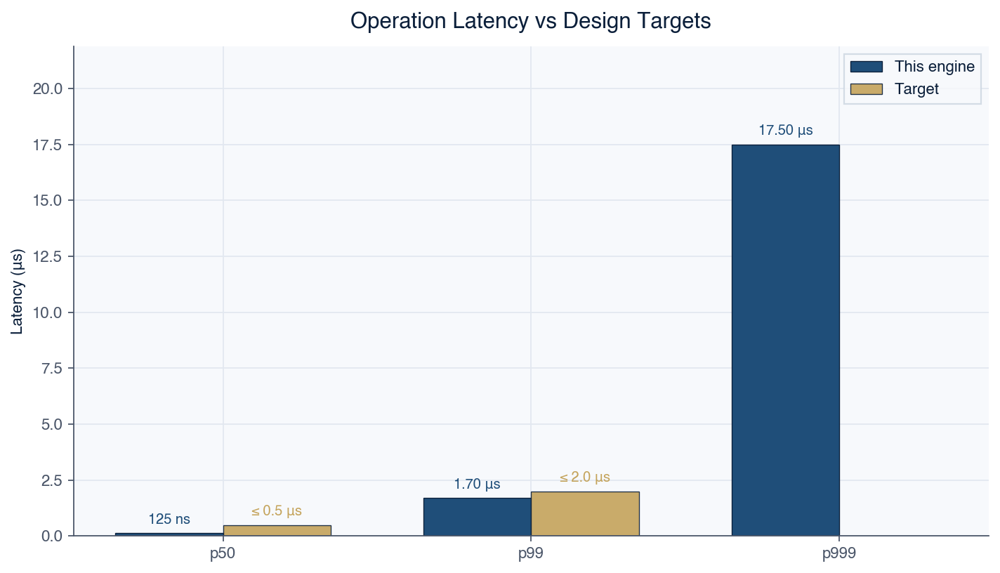
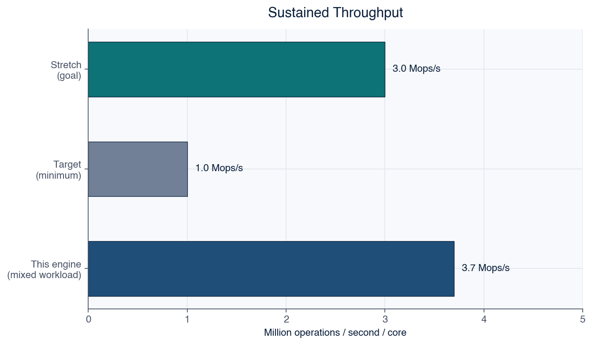
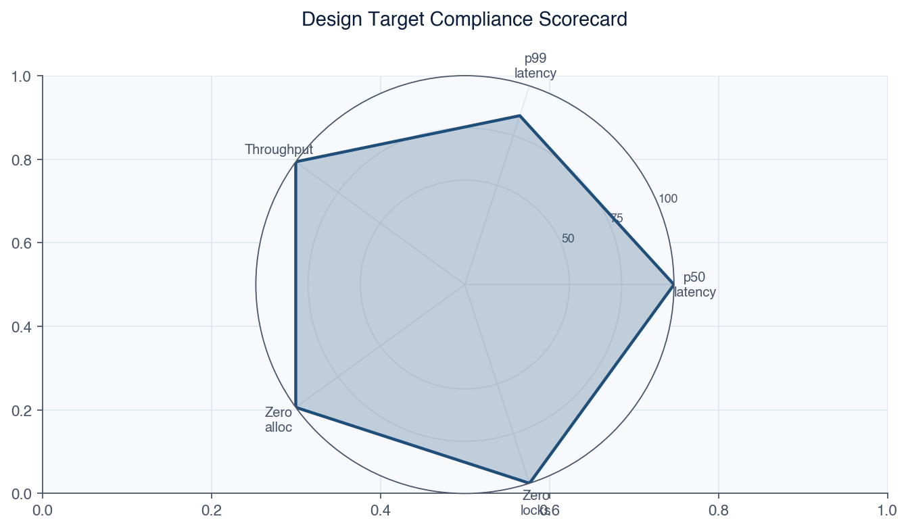
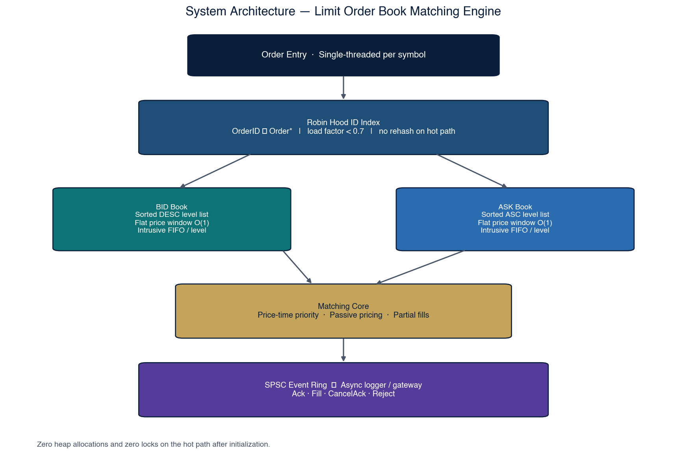
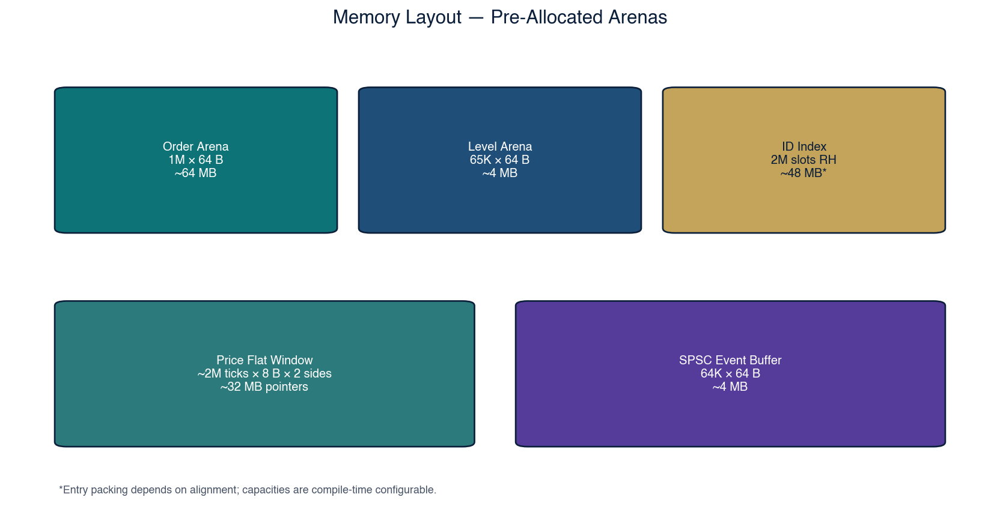
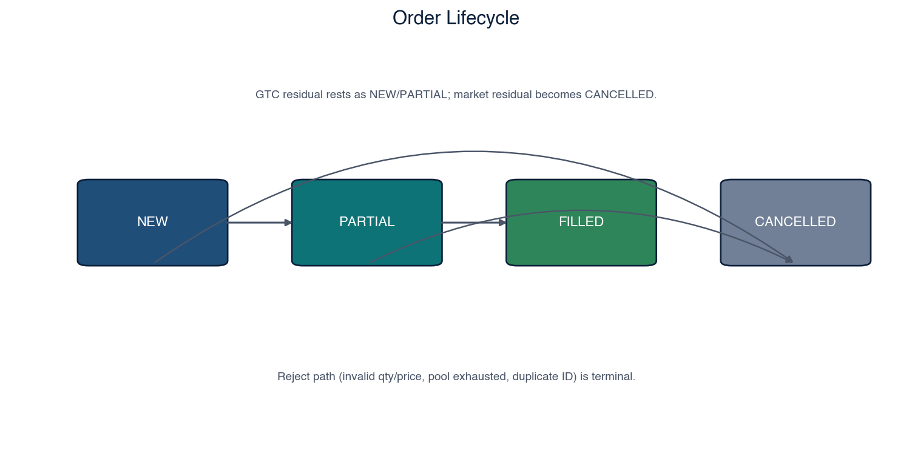
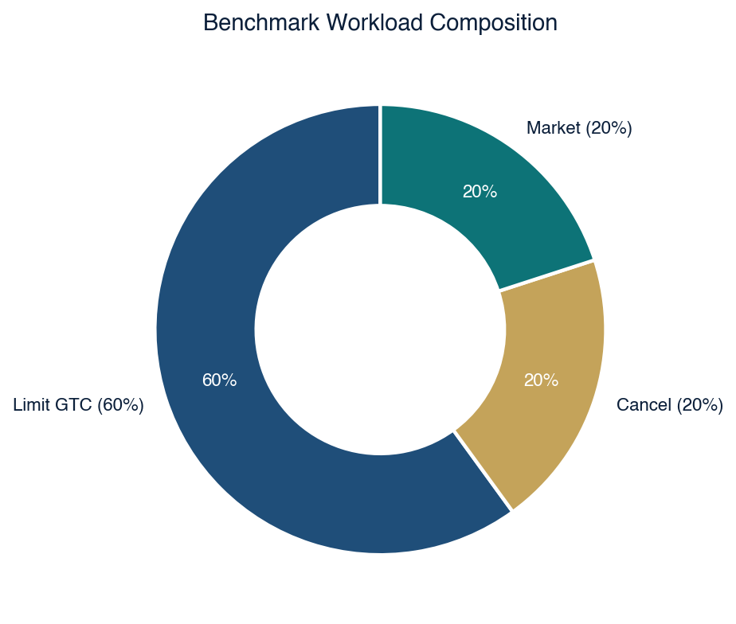
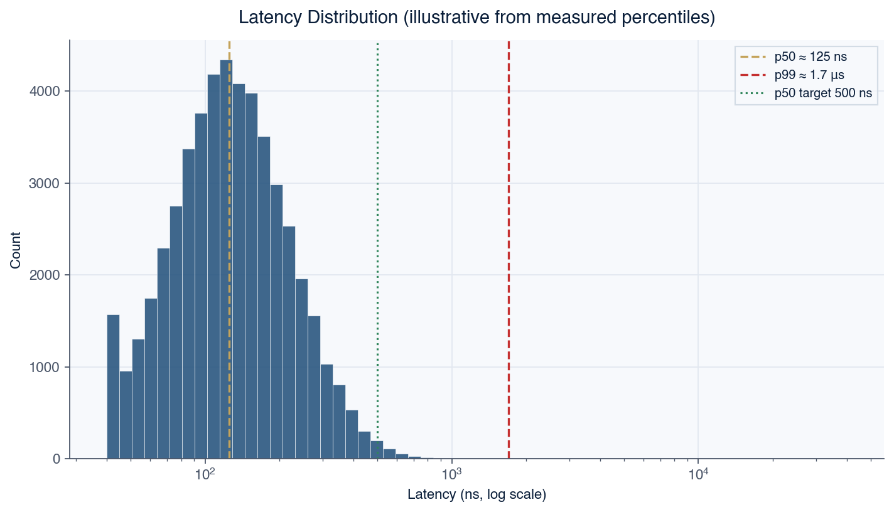
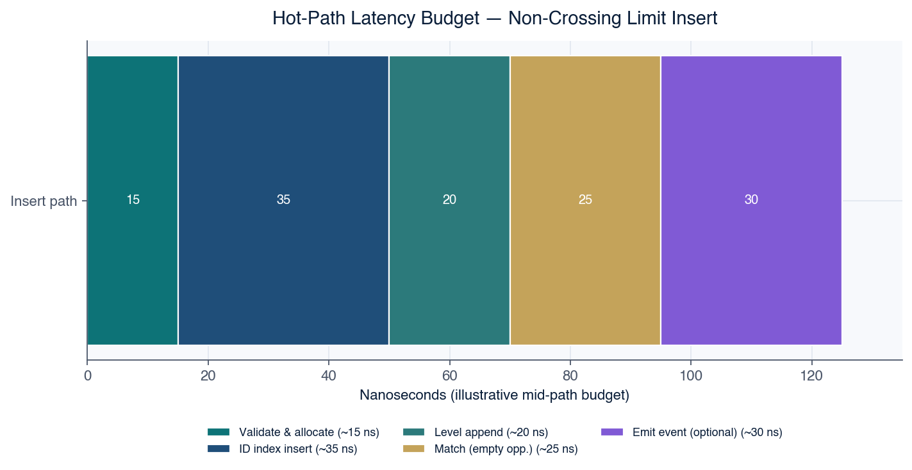
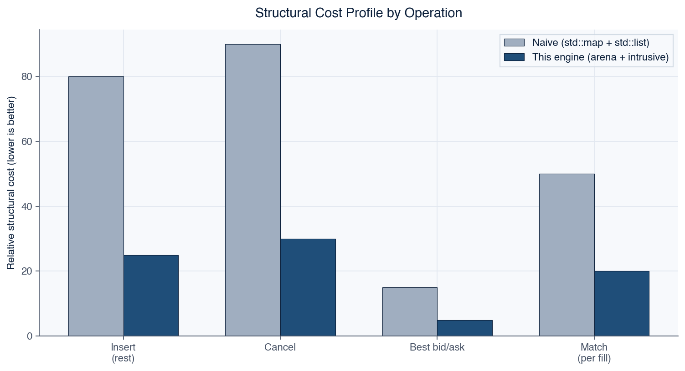

# Quark

### High-performance C++20 limit order book matching engine

[](.github/workflows/ci.yml)
[](CMakeLists.txt)
[](LICENSE)
[](docs/DESIGN.md)

A production-shaped **limit order book (LOB) matching engine** implemented in modern C++. The design targets the constraints used in low-latency trading systems: pre-allocated memory, cache-line-aligned structures, lock-free output, and rigorous correctness testing against a reference implementation.

| | |
|:--|:--|
| **Documentation** | [Full index](docs/INDEX.md) · [Design spec](docs/DESIGN.md) · [Performance report](docs/PERFORMANCE.md) |
| **Primary API** | `me::OrderBook` — `insert` / `cancel` / `poll_events` |
| **Build** | CMake ≥ 3.16, C++20, Ninja recommended |

---

## Performance at a glance

Representative **Release** results on Apple Silicon (`-O3 -march=native`), mixed workload (60% limit / 20% cancel / 20% market), events disabled on the timed path:

| Metric | Result | Design target |
|--------|--------|----------------|
| Latency **p50** | ~**125 ns** | &lt; 500 ns |
| Latency **p99** | ~**1.7 μs** | &lt; 2 μs |
| Throughput | ~**3.7 Mops/s**/core | ≥ 1 Mops/s |
| Hot-path allocations | **0** | 0 |
| Hot-path locks | **0** | 0 |

<p align="center">
  
</p>

<p align="center">
  
</p>

<p align="center">
  
</p>

> **Note.** Absolute nanoseconds depend on CPU, OS noise, and thermal state. Re-run `./build/me_bench` on your hardware. Full methodology and interpretation: **[docs/PERFORMANCE.md](docs/PERFORMANCE.md)**.

---

## Architecture

<p align="center">
  
</p>

| Subsystem | Design choice |
|-----------|----------------|
| **Order storage** | Pre-allocated arena + free list; each `Order` is `alignas(64)` |
| **Price levels** | Intrusive doubly-linked **FIFO** queues (price–time priority) |
| **Best bid / ask** | Intrusive sorted level lists — **O(1)** head access |
| **Price → level** | Dense flat window **O(1)** + overflow hash map |
| **Cancel path** | Robin Hood open-addressing map: `OrderID → Order*` |
| **Output** | Lock-free **SPSC** ring of `EngineEvent` (ack / fill / cancel / reject) |

<p align="center">
  
</p>

<p align="center">
  
</p>

Formal specification: **[docs/DESIGN.md](docs/DESIGN.md)** · Component detail: **[docs/architecture.md](docs/architecture.md)**

---

## Quick start

### Prerequisites

- CMake ≥ 3.16  
- A C++20 compiler (Clang, Apple Clang, or GCC)  
- Ninja (recommended)

### Build, test, benchmark

```bash
git clone https://github.com/knokvik/quark.git
cd quark

cmake -S . -B build -G Ninja -DCMAKE_BUILD_TYPE=Release
cmake --build build -j

./build/me_tests     # correctness suite
./build/me_bench     # latency + throughput harness
```

Helper script:

```bash
./scripts/run_release.sh
```

### Minimal usage

```cpp
#include "me/order_book.hpp"

int main() {
    me::OrderBook book;

    book.insert(1, me::Side::Bid, me::OrderType::Limit, /*$100.00*/ 100'0000, 10);
    book.insert(2, me::Side::Ask, me::OrderType::Limit, 100'0000, 10); // crosses → fill

    me::EngineEvent events[64];
    book.poll_events(events, 64);
}
```

Prices are **fixed-point** integers: `ticks = dollars × 10 000` (four decimal places).

---

## Workload and latency profile

<p align="center">
  
</p>

<p align="center">
  
</p>

<p align="center">
  
</p>

<p align="center">
  
</p>

---

## Project structure

```text
quark/
├── include/me/           Public headers (order book, pools, index, events)
├── src/order_book.cpp    Matching implementation
├── tests/                Unit + differential tests vs naive reference book
├── bench/                Latency / throughput harness
├── docs/                 Design, performance, and figures (docs/assets/)
├── examples/             Usage sketches
├── scripts/              Release helper + chart generator
├── CMakeLists.txt
└── LICENSE
```

---

## Correctness

| Category | Coverage |
|----------|----------|
| Priority | FIFO within level; price–time across levels |
| Fills | Full and partial; multi-level sweeps |
| Safety | Cancel missing ID; duplicate ID; pool exhaustion |
| Differential | Randomized stream vs `std::map` + `std::list` reference |

```bash
./build/me_tests
# Passed: N  Failed: 0
```

Checklist: [docs/correctness.md](docs/correctness.md)

---

## Documentation map

| Document | Contents |
|----------|----------|
| **[docs/INDEX.md](docs/INDEX.md)** | Master documentation index |
| **[docs/DESIGN.md](docs/DESIGN.md)** | Formal design specification |
| **[docs/PERFORMANCE.md](docs/PERFORMANCE.md)** | Benchmark report with all figures |
| **[docs/architecture.md](docs/architecture.md)** | Data-flow and component diagrams |
| [docs/memory.md](docs/memory.md) | Arena / free-list strategy |
| [docs/robin_hood.md](docs/robin_hood.md) | ID index design |
| [docs/intrusive_lists.md](docs/intrusive_lists.md) | Why not `std::list` |
| [docs/roadmap.md](docs/roadmap.md) | IOC/FOK, sharding, SPSC ingress, … |

Regenerate publication charts:

```bash
python3 scripts/generate_charts.py
```

---

## Design constraints (summary)

1. **No `malloc` / `new` on the hot path** after construction.  
2. **No mutexes or atomics inside the book** (SPSC boundary only for events).  
3. **Fixed-point prices** — never `double` on the match path.  
4. **Intrusive FIFO** for true price–time priority without allocator nodes.  
5. **Reject under resource exhaustion** — never unbounded growth mid-stream.

---

## License

This project is released under the [MIT License](LICENSE).

---

*Built as a rigorous demonstration of low-latency systems engineering: memory hierarchy, cache-aware data structures, and disciplined performance measurement.*
