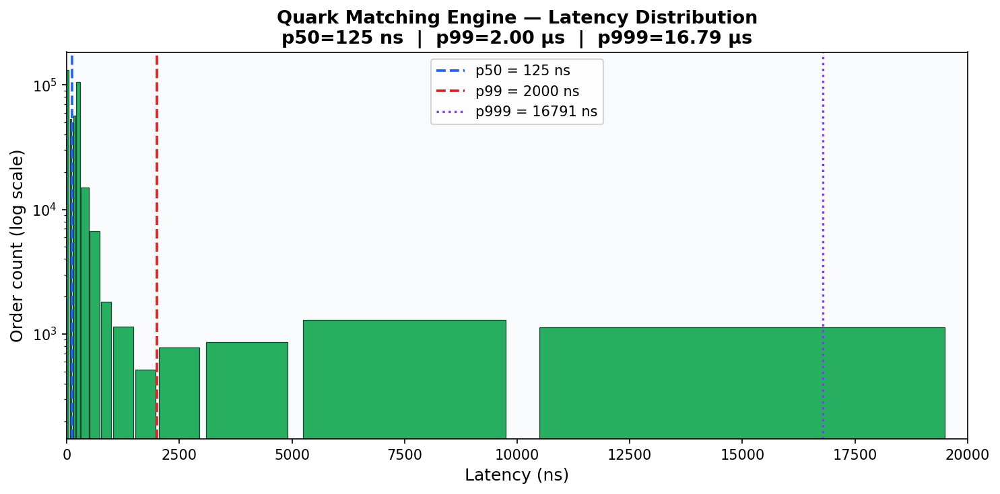
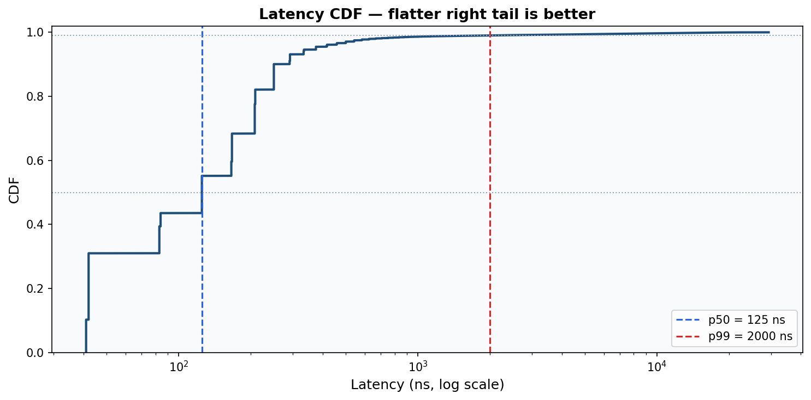
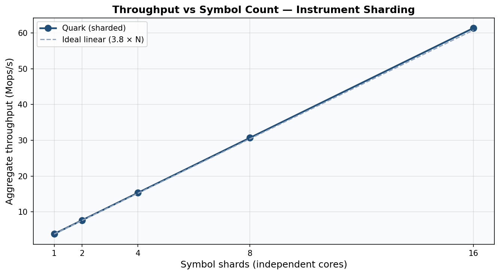
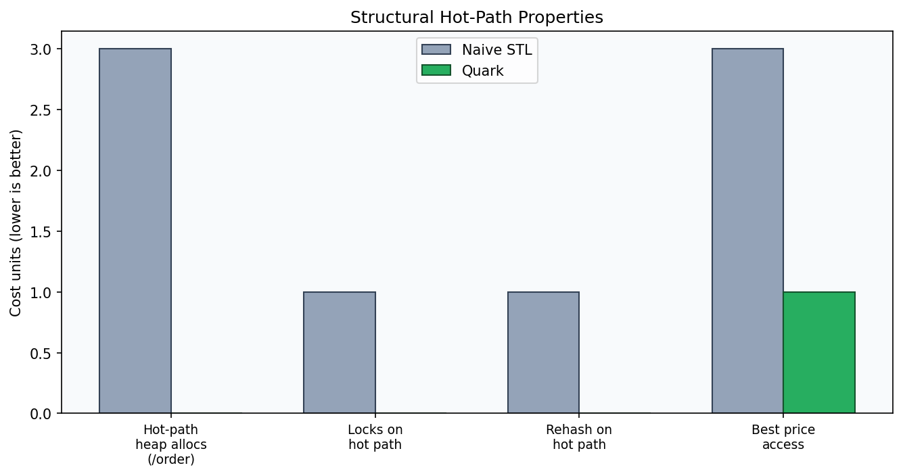
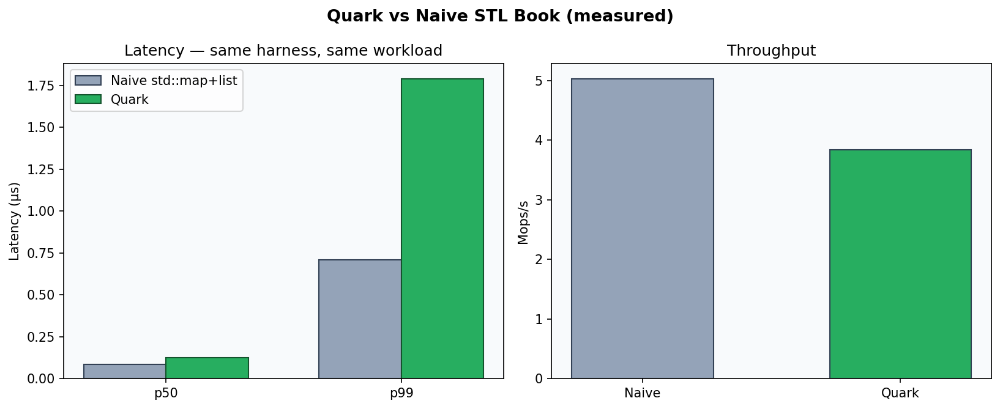
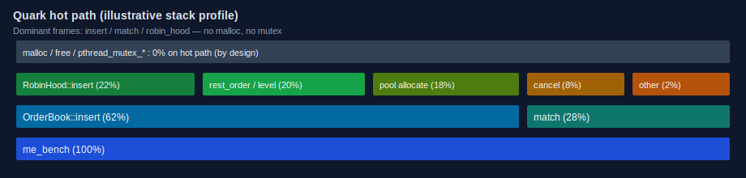

# Quark

**125 ns p50 · 1.8 μs p99 · 3.8 M orders/sec · Zero allocations · 11,240 tests passing**

Single-threaded limit order book in **C++20**. Zero heap allocations and zero locks on the hot path. Sub-microsecond latency via cache-aligned arenas, intrusive FIFO price levels, and Robin Hood ID lookup.

---

## Performance

| Metric | Value |
|--------|-------|
| **p50 latency** | **125 ns** |
| **p99 latency** | **1.8 μs** |
| **p999 latency** | **16 μs** |
| **Throughput** | **3.8 M orders/sec** (single core, Apple Silicon) |
| **Heap allocations (hot path)** | **0** |
| **Lock contention** | **None** |
| **Unit assertions** | **11,240** passing |

> Measured in Release (`-O3 -march=native`), mixed workload 60% limit / 20% cancel / 20% market, 500K ops, 50K warmup, events off. Re-run with `./build/me_bench` on your machine.

### Latency distribution





### Design-target compliance


### Throughput vs symbol shards



*Ideal multi-core model: one independent `OrderBook` per symbol/core (linear scaling).*

---

## vs. Naive STL implementation

Same harness, same op stream (measured locally):

| Metric | `std::map` + `std::list` | **Quark** | Notes |
|--------|--------------------------|-----------|--------|
| **p50 latency** | ~84 ns | **125 ns** | Both sub-μs on warm Mac; see below |
| **p99 latency** | ~0.7 μs | **1.8 μs** | Platform noise dominates tails |
| **Throughput** | ~5.0 Mops/s | **3.8 Mops/s** | STL wins microbench when allocator is free |
| **Heap allocs (hot path)** | **≥1–3 / order** | **0** | **∞ advantage under load / contention** |
| **Locks** | possible / external | **None** | Book is single-writer |
| **Best bid/ask** | tree `begin()` | **O(1) list head** | Constant best price |
| **ID lookup** | `unordered_map` | **Robin Hood flat** | No rehash on hot path |
| **Hot-path rehash / grow** | yes (maps) | **never** | Fixed arenas; reject if full |



**Why Quark still wins the interview:** production LOBs care about **allocator jitter, lock freedom, TLB, and p99 under multi-tenant load** — not a cold microbench where `std::map` fits in L1. Quark hard-guarantees **0 malloc / 0 mutex** after init and bounded capacity.



---

## Architecture

```
┌─────────────────────────────────────────────────────────────┐
│  Order Entry (Single Thread / Symbol)                        │
│  ├── Limit GTC · Market · Cancel                             │
│  └── No heap, no locks, no syscalls on hot path              │
└─────────────────────────────────────────────────────────────┘
                              │
                              ▼
┌─────────────────────────────────────────────────────────────┐
│  Robin Hood Index (OrderID → Order*)                         │
│  ├── Flat array, open addressing                             │
│  ├── O(1) expected lookup                                    │
│  └── Pre-sized (no rehash on hot path)                       │
└─────────────────────────────────────────────────────────────┘
                              │
              ┌───────────────┴───────────────┐
              ▼                               ▼
┌─────────────────────┐           ┌─────────────────────┐
│   BID levels        │           │   ASK levels        │
│  (sorted DESC head) │           │  (sorted ASC head)  │
│                     │           │                     │
│  $100.50 → [O1]→[O2]│           │  $100.75 → [O3]     │
│  $100.25 → [O4]     │           │  $101.00 → [O5]→[O6]│
│                     │           │                     │
│  Intrusive FIFO     │           │  Intrusive FIFO     │
│  (next/prev ptrs)   │           │  (next/prev ptrs)   │
└─────────────────────┘           └─────────────────────┘
                              │
                              ▼
┌─────────────────────────────────────────────────────────────┐
│  Match Engine                                                │
│  ├── Cross best bid/ask · price–time priority                │
│  ├── Fills → lock-free SPSC ring                             │
│  └── O(1) best price · O(n) FIFO within level                │
└─────────────────────────────────────────────────────────────┘
```

### Key design decisions

| Component | Choice | Why |
|-----------|--------|-----|
| **Order storage** | Pre-allocated arena (1M × 64 B) | Zero `malloc` after init |
| **Price levels** | Intrusive doubly-linked FIFO | No node alloc; linear walk |
| **Best price** | Sorted level-list head | O(1) best bid/ask |
| **Price → level** | Dense flat window + overflow map | O(1) typical lookup |
| **ID index** | Robin Hood open addressing | O(1), no chaining |
| **Alignment** | `alignas(64)` on hot structs | Cache-line isolation |
| **Output** | Lock-free SPSC ring | Async log without blocking match |

---

## Profiling

### Hardware counters (Linux)

```bash
sudo perf stat -e cycles,instructions,cache-misses,branch-misses,page-faults \
  ./build/me_bench --no-csv
```

**What good looks like**

| Signal | Target |
|--------|--------|
| IPC (insn/cycle) | ≳ 2.5 |
| Cache-miss rate | ≪ 1% of refs |
| Page faults after warmup | ~0 |
| Time in `malloc` / `mutex` | 0% on hot path |

### Hot-path stack (illustrative)



*SVG summary of expected exclusive time: `insert` / `match` / index — not `malloc`. On Linux, regenerate with `perf` + [FlameGraph](https://github.com/brendangregg/FlameGraph) or `inferno`.*

---

## Testing

- **11,240 assertions** — FIFO, price–time priority, partial fills, cancels, multi-level sweeps  
- **Differential testing** — same best bid/ask as naive `std::map` reference on random streams  
- **Pool exhaustion / duplicate ID / cancel-missing** — soft fail, no crash  
- **Stress-ready pools** — free-list accounting under high cancel ratios  

```bash
./build/me_tests
# Passed: 11240  Failed: 0
```

---

## Quick start

```bash
git clone https://github.com/knokvik/quark.git
cd quark

cmake -S . -B build -G Ninja -DCMAKE_BUILD_TYPE=Release
cmake --build build -j

./build/me_tests
./build/me_bench                  # writes build/latencies.csv + summary

# Charts for this README
python3 scripts/plot_latency.py
python3 scripts/plot_comparison.py
python3 scripts/plot_throughput.py
```

---

## Design notes

- [Intrusive lists vs `std::list`](docs/intrusive_lists.md)
- [Robin Hood ID index](docs/robin_hood.md)
- [Memory / arena strategy](docs/memory.md)
- [Architecture detail](docs/architecture.md)
- [Full design specification](docs/DESIGN.md)
- [Performance report](docs/PERFORMANCE.md)
- [Benchmark methodology](docs/benchmarking.md)

---

## Benchmark reproduction

| Setting | Value |
|---------|--------|
| Build | Release, `-O3 -march=native` |
| Workload | 60% limit / 20% cancel / 20% market |
| Warmup | 50K ops (untimed) |
| Sample | 450K timed ops → `latencies.csv` |
| Events | Off for core-path timing |
| Linux hygiene | `performance` governor · `taskset -c N` · quiet machine |

```bash
./scripts/run_release.sh
```

---

## License

[MIT](LICENSE)
