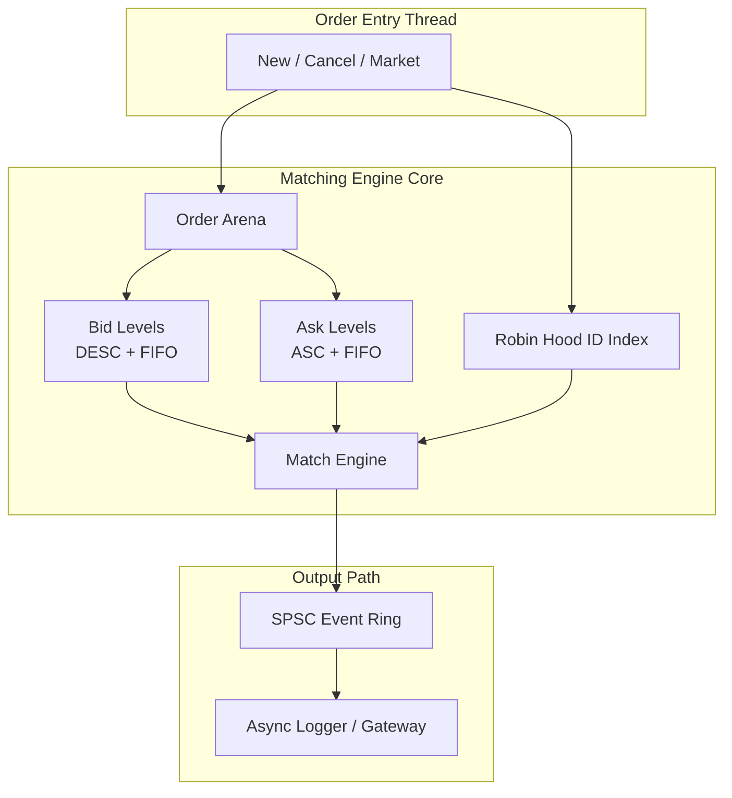
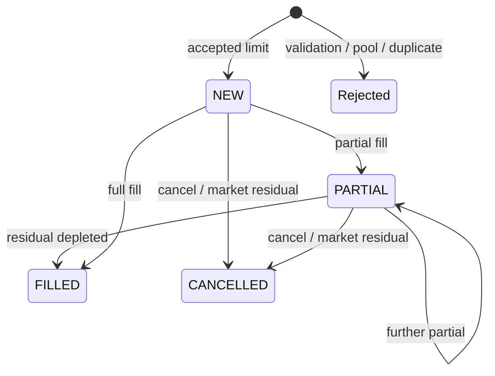
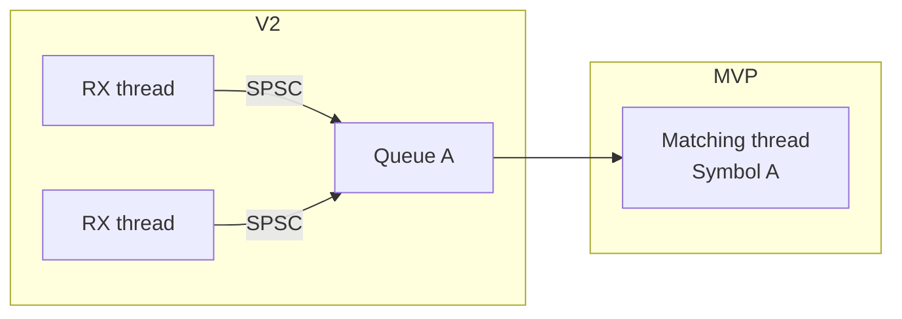

# Design Specification  
## Quark — Limit Order Book Matching Engine (C++20)

| Field | Value |
|-------|--------|
| **Document status** | Released (MVP v1.0) |
| **Language standard** | ISO C++20 |
| **Concurrency model** | Single-threaded per symbol |
| **Primary goals** | Sub-microsecond p50 latency · ≥1 Mops/s/core · zero hot-path heap · zero hot-path locks |

---

## 1. Purpose and scope

This document specifies the design of a **high-performance limit order book (LOB) matching engine** intended as a production-shaped portfolio system for low-latency / HFT-style engineering roles.

### 1.1 In scope (MVP)

- Single instrument (symbol)
- Limit orders (GTC)
- Market orders (immediate liquidity only; residual cancelled)
- Cancel by order identifier
- Price–time priority matching
- Asynchronous event emission (ack / fill / cancel / reject)

### 1.2 Out of scope (MVP)

- Multi-symbol ownership inside one thread without sharding
- IOC / FOK / stop / iceberg (see [roadmap.md](roadmap.md))
- Network I/O (DPDK / AF_XDP)
- Persistence / snapshot–recovery
- Self-trade prevention policies

---

## 2. Design principles

1. **Deterministic hot path** — no heap allocation, no locks, no syscalls after initialization.
2. **Cache-first layout** — hot structs are `alignas(64)` (one hardware cache line).
3. **Intrusive data structures** — list nodes live inside pre-allocated objects; no allocator nodes.
4. **Bounded variance** — fixed-capacity indexes and arenas; reject under exhaustion rather than grow.
5. **Correctness under reference** — differential testing against a slow STL book.

---

## 3. System architecture


### 3.1 Logical components

| Component | Responsibility |
|-----------|----------------|
| **Order entry** | Validate and admit orders on the matching thread |
| **Order pool** | Bump allocator + free list for `Order` objects |
| **Level pool** | Arena for `PriceLevel` objects |
| **Robin Hood index** | `OrderID → Order*` for cancel / lookup |
| **Bid / ask books** | Per-side price levels with FIFO queues |
| **Matching core** | Cross best bid/ask; emit fills |
| **SPSC ring** | Decouple matching from logging / gateway I/O |

### 3.2 Data flow (Mermaid)



---

## 4. Data structures

### 4.1 Order (atom)

Exactly **one cache line** (64 bytes):

| Field | Type | Notes |
|-------|------|--------|
| `id` | `uint64_t` | Unique order identifier (≠ 0) |
| `price` | `uint64_t` | Fixed-point: dollars × 10⁴ |
| `quantity` | `uint32_t` | Original size |
| `filled_qty` | `uint32_t` | Cumulative filled |
| `side` | `Side` | Bid / Ask |
| `type` | `OrderType` | Limit / Market |
| `status` | `OrderStatus` | Lifecycle state |
| `next` / `prev` | `Order*` | Intrusive FIFO links |
| `level` | `PriceLevel*` | Back-pointer for O(1) cancel |

### 4.2 Price level

One cache line holding aggregate quantity, order count, and FIFO `head` / `tail`.  
`left` / `right` link levels into a **side-sorted intrusive list** (best price at the head).

### 4.3 Price lookup

| Mechanism | Complexity | Role |
|-----------|------------|------|
| Dense flat window (`PriceLevel*` array) | O(1) | Prices in the primary trading band |
| Overflow Robin Hood map | O(1) avg | Prices outside the dense window |
| Sorted level list head | O(1) | Best bid / best ask |

### 4.4 Order ID index

Robin Hood open addressing on a power-of-two table:

- Load factor maintained **&lt; 0.7**
- **No rehash** on the hot path
- Backward-shift deletion (no tombstone accumulation)

See [robin_hood.md](robin_hood.md).

---

## 5. Matching algorithm

### 5.1 Priority

1. **Price priority** — better price trades first (higher bid / lower ask).
2. **Time priority** — within a price, FIFO (queue head is oldest).

### 5.2 Trade price

Fills execute at the **passive (resting) order’s price** (standard price improvement for the aggressor).

### 5.3 Insert (limit)

```
allocate Order from pool
insert into Robin Hood index
if crosses opposite best:
    match while residual > 0 and prices cross
    if residual > 0 and GTC: rest on book
else:
    rest on book
emit Ack (+ Fills as generated)
```

### 5.4 Cancel

```
lookup Order* by id
unlink from price-level FIFO (O(1) via prev/next + level)
if level empty: remove level from side list + price map
return Order to free list
erase from Robin Hood index
emit CancelAck
```

### 5.5 Lifecycle




---

## 6. Memory model


| Arena | Default capacity | Approx. footprint |
|-------|------------------|-------------------|
| Orders | 1 048 576 × 64 B | ~64 MB |
| Levels | 65 536 × 64 B | ~4 MB |
| ID index | 2 097 152 slots | tens of MB (aligned entries) |
| Price flat window | ~2M ticks × 2 sides | ~32 MB pointers |
| Event ring | 65 536 × 64 B | ~4 MB |

**Circuit breaker:** if the order or level pool is exhausted, the engine **rejects** the operation. It does not grow.

---

## 7. Concurrency



MVP: the book is **not** thread-safe. External serialization (one thread per symbol, or a single producer into the book) is required.

---

## 8. Correctness strategy

| Layer | Method |
|-------|--------|
| Unit tests | FIFO, partial fill, cross prevention, cancel, pool exhaustion, multi-level sweep |
| Differential | Random op stream vs `NaiveBook` (`std::map` + `std::list`) — equal best bid/ask |
| Stress (documented) | High cancel ratio, pool cap, burst inserts |

---

## 9. Non-functional targets

| Metric | Target | Stretch |
|--------|--------|---------|
| Insert / op latency p50 | &lt; 500 ns | &lt; 300 ns |
| Insert / op latency p99 | &lt; 2 μs | &lt; 1 μs |
| Throughput | ≥ 1 Mops/s/core | ≥ 3 Mops/s/core |
| Hot-path allocations | 0 | 0 |
| Hot-path locks | 0 | 0 |

Detailed results: [PERFORMANCE.md](PERFORMANCE.md).

---

## 10. Build and tooling

```text
-std=c++20 -O3 -march=native -DNDEBUG
CMake ≥ 3.16  ·  optional LTO (ME_ENABLE_LTO)
```

Continuous integration builds on Ubuntu and macOS (see `.github/workflows/ci.yml`).

---

## 11. References (design literature)

- Price–time priority continuous double auction (standard LOB model)
- Robin Hood hashing (Celis et al.; practical open-addressing variants)
- Intrusive containers and arena allocation patterns in low-latency C++
- SPSC ring buffers for thread-decoupled logging

---

*End of design specification.*
