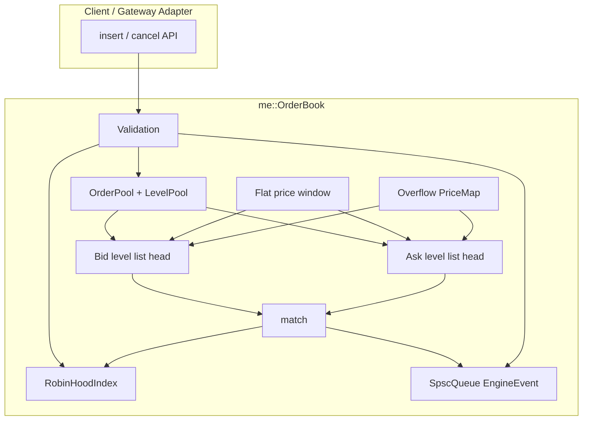
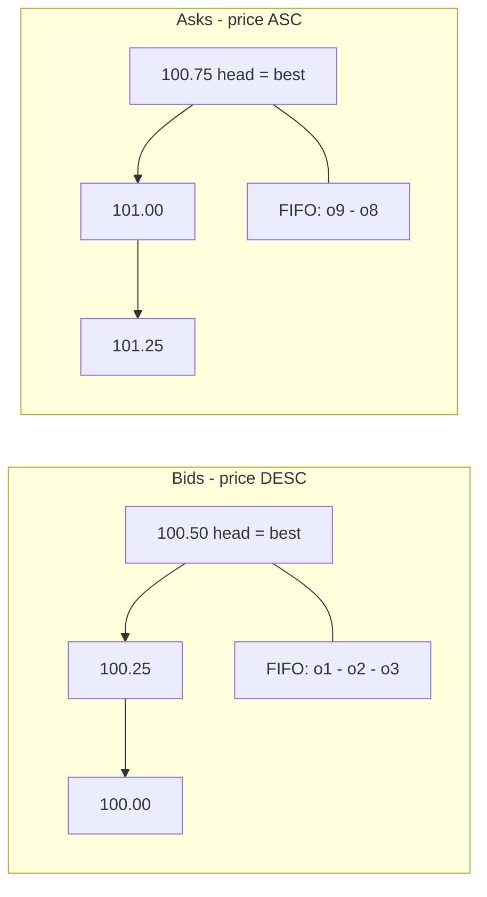
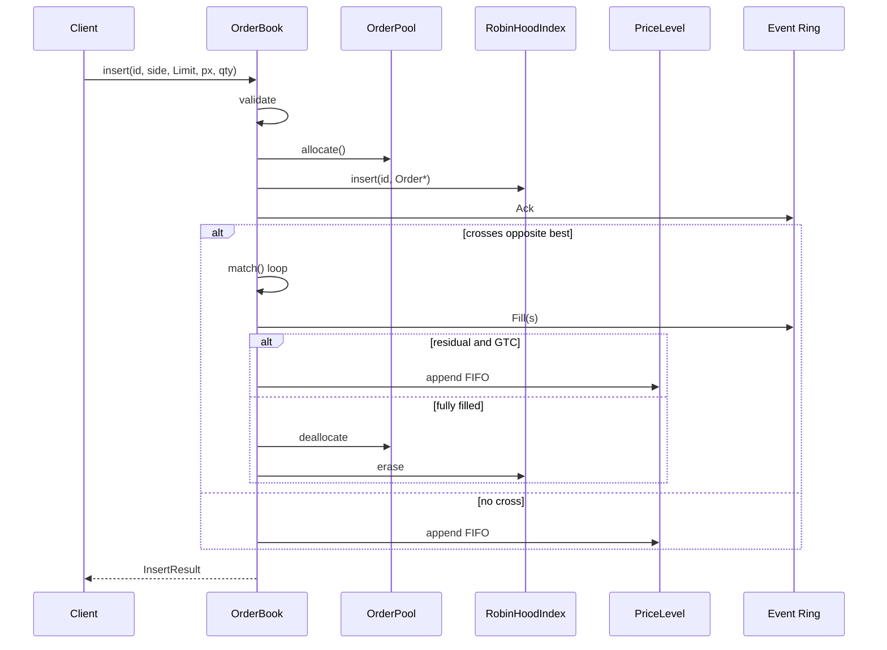

# Architecture Overview

## 1. High-level view


The engine is a **single-writer** matching core for one instrument. All mutation of book state occurs on one thread. Output is decoupled through a lock-free SPSC ring so logging never stalls matching under normal load (events may drop if the ring is full — matching never blocks).

---

## 2. Component diagram



---

## 3. Bid / ask geometry



- **Best bid** = head of bid level list  
- **Best ask** = head of ask level list  
- Cross when `best_bid >= best_ask` (or market ignores limit check)

---

## 4. Memory and ownership


| Object | Owner | Lifetime |
|--------|--------|----------|
| `Order` | `OrderPool` | allocate on insert; free on fill/cancel/reject |
| `PriceLevel` | `LevelPool` | create on first rest at price; free when empty |
| Index entry | `RobinHoodIndex` | insert with order; erase on destroy |
| Event | `SpscQueue` | produced by book; consumed by `poll_events` |

---

## 5. Control flow — insert limit



---

## 6. Concurrency model (MVP)

One thread owns one symbol book. **No mutexes and no atomics inside the book.**

```text
[Thread 0] ---> Symbol A book
[Thread 1] ---> Symbol B book
[Thread 2] ---> Symbol C book
```

v2 ingress: multiple RX threads → per-symbol SPSC → matching thread (see [spsc_ingress.md](spsc_ingress.md)).

---

## 7. Matching rules (normative)

| Rule | Specification |
|------|----------------|
| Priority | Price, then time (FIFO within price) |
| Trade price | Passive order price |
| Limit residual | Rest as GTC |
| Market residual | Do not rest; cancel remainder |
| Cancel complexity | O(1) expected (hash) + O(1) list unlink |

Lifecycle figure: 

---

## 8. Related documents

- [DESIGN.md](DESIGN.md) — full design specification  
- [PERFORMANCE.md](PERFORMANCE.md) — measurements and charts  
- [memory.md](memory.md) — arenas and free lists  
- [robin_hood.md](robin_hood.md) — ID index  
